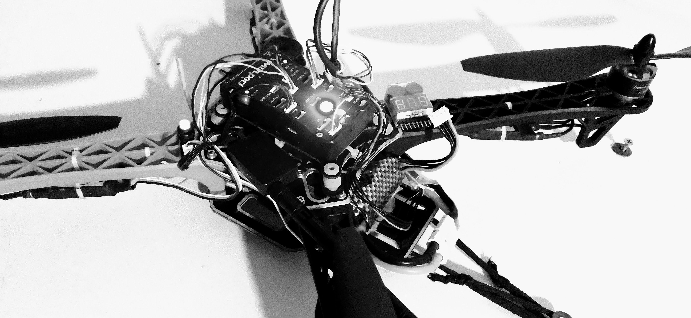
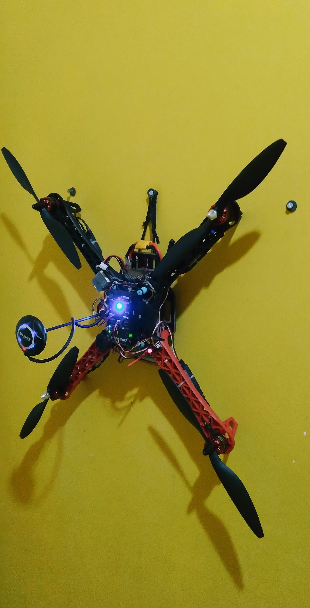
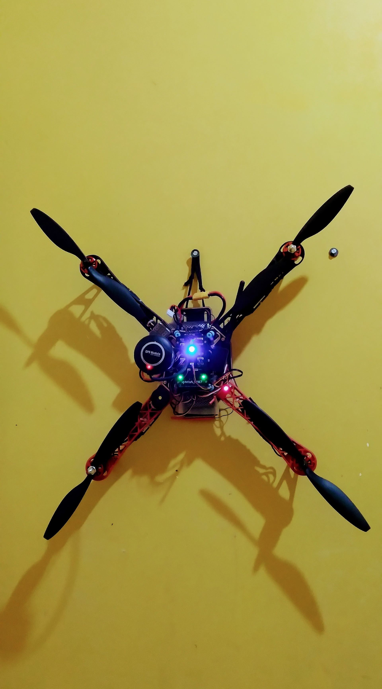

<h1 align="center">
  Projeto - Drone QuadCopter IA | Siga-Me
</h1>

<h3 align="center">
  Universidade Federal do Pará  
  Campus Universitário de Tucuruí  
  Faculdade de Engenharia Elétrica   
</h3>

<h1 align="center">
  
</h1>

<h2>
  Objetivo
</h2>

  1° Montar um Drone Quadcopter utilizando como base o Controlador de voo de hardware open-source Pixhawk e o firmware open-source PX4 Autopilot. Além disso, utilizar a Estação Terrestre QGC - QGroundControl para controlar o Drone pelo Notebook, Celular ou Tablet.  

  2° Desenvolver um algorítimo Siga-me usando Visão Computacional e Inteligência Artificial com OpenCV e usando o protocolo de comunicação MAVLINK é o framework MAVSDK Python.  

  

    
    
    
  
